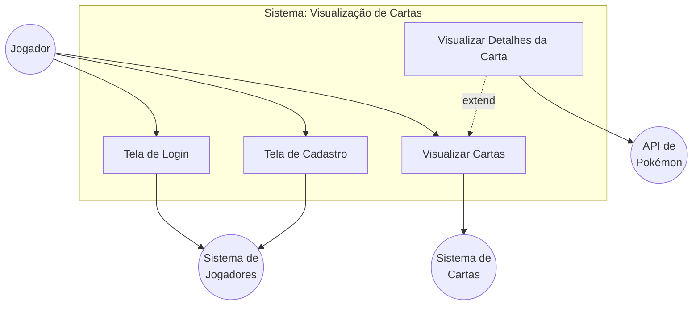
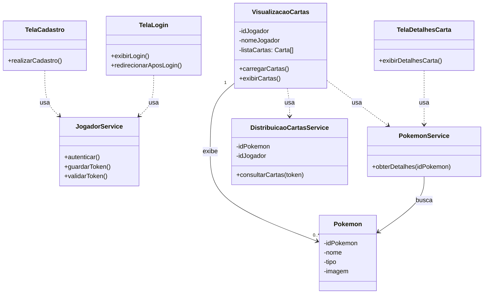

# 🃏 Visualização de Cartas — Pokémon Card Viewer

Aplicação responsável por exibir as cartas Pokémon de cada jogador. Consulta os serviços de **distribuição de cartas** e de **jogadores** para recuperar as informações necessárias, além de integrar com a **PokéAPI** para obter os dados completos de cada Pokémon.

> Projeto desenvolvido como parte de um sistema distribuído de gerenciamento de cartas Pokémon.

---

## 📋 Índice

- [Sobre a Aplicação](#sobre-a-aplicação)
- [Funcionalidades](#funcionalidades)
- [Diagramas](#diagramas)
  - [Diagrama de Caso de Uso](#diagrama-de-caso-de-uso)
  - [Diagrama de Classes](#diagrama-de-classes)
- [Tecnologias](#tecnologias)
- [Estrutura do Projeto](#estrutura-do-projeto)
- [Como Executar](#como-executar)
- [Integração com Serviços Externos](#integração-com-serviços-externos)

---

## Sobre a Aplicação

Esta aplicação é o **frontend** do módulo de Visualização de Cartas dentro do sistema distribuído. Ela tem a responsabilidade de:

- Consultar o **Serviço de Jogadores** para autenticar e recuperar dados do jogador logado
- Consultar o **Serviço de Distribuição de Cartas** para obter as cartas atribuídas a cada jogador
- Consultar a **PokéAPI** para enriquecer os dados de cada carta com informações detalhadas do Pokémon (tipo, habilidades, altura, peso, habitat, etc.)
- Exibir as cartas de forma visual e interativa para o usuário

> ⚠️ **Estado atual:** a aplicação conta com um layout funcional utilizando dados mockados. A integração real com os serviços externos está prevista para as próximas etapas do projeto.

---

## Funcionalidades

- **Visualização de cartas em carrossel** — navegação fluida entre as cartas do jogador
- **Detalhes do Pokémon** — modal com informações completas ao clicar em uma carta (HP, Ataque, Defesa, tipo, habitat, habilidades, peso e altura)
- **Perfil do usuário** — exibição do nome e nível do jogador logado no header, com menu de configurações e logout
- **Design responsivo** — adaptado para desktop, tablet e mobile
- **Animações** — transições suaves com Framer Motion (biblioteca `motion`)

---

## Diagramas

### Diagrama de Caso de Uso



### Diagrama de Classes



[Versão dos diagramas no miro](https://miro.com/welcomeonboard/Mlc0NDJwdDlRTXRKUFdyUUt4KzdZZ1J0NllXN1M0YldsbVBVcVNzY3Y2RkIzN2dnUjFzalVaeEplUTRWTnAvRmd5SXhVUHZ6WkVYQ1pWRXBXbmpiT3hEUDRVUEFuNVU3aGtkNGNUOVB1VFc1VUFXV1F5QXJzcU0rSWVxVDd3VDVnbHpza3F6REdEcmNpNEFOMmJXWXBBPT0hdjE=?share_link_id=404047321847).

---

## Tecnologias

| Tecnologia | Versão | Uso |
|---|---|---|
| [React](https://react.dev/) | 18.3.1 | Biblioteca principal de UI |
| [TypeScript](https://www.typescriptlang.org/) | — | Tipagem estática |
| [Vite](https://vitejs.dev/) | 6.3.5 | Bundler e servidor de desenvolvimento |
| [Tailwind CSS](https://tailwindcss.com/) | 4.1.12 | Estilização utilitária |
| [Motion (Framer Motion)](https://motion.dev/) | 12.23.24 | Animações e transições |
| [Lucide React](https://lucide.dev/) | 0.487.0 | Ícones |
| [React Slick](https://react-slick.neostack.com/) | 0.31.0 | Carrossel de cartas |

---

## Estrutura do Projeto

```
cardViewing/
├── src/
│   ├── app/
│   │   ├── App.tsx                          # Componente raiz — layout principal e carrossel
│   │   └── components/
│   │       ├── PokemonCard.tsx              # Card individual de Pokémon
│   │       ├── PokemonDetailsModal.tsx      # Modal com detalhes do Pokémon
│   │       ├── PlayerDetailsModal.tsx       # Modal com detalhes do jogador
│   │       ├── UserProfile.tsx              # Perfil do usuário no header
│   │       ├── figma/
│   │       │   └── ImageWithFallback.jsx    # Componente de imagem com fallback
│   │       └── ui/                          # Componentes de UI reutilizáveis (shadcn/ui)
│   ├── styles/
│   │   ├── index.css                        # Estilos globais
│   │   ├── tailwind.css                     # Importação do Tailwind
│   │   └── theme.css                        # Variáveis de tema
│   └── main.tsx                             # Ponto de entrada da aplicação
├── index.html
├── vite.config.ts
├── package.json
└── postcss.config.mjs
```

---

## Como Executar

### Pré-requisitos

- [Node.js](https://nodejs.org/) v18 ou superior
- [npm](https://www.npmjs.com/) ou [pnpm](https://pnpm.io/)

### Instalação

```bash
# Clone o repositório
git clone <url-do-repositório>
cd cardViewing

# Instale as dependências
npm install
# ou
pnpm install
```

### Desenvolvimento

```bash
npm run dev
```

A aplicação estará disponível em `http://localhost:5173`.

### Build para produção

```bash
npm run build
```

Os arquivos de produção serão gerados na pasta `dist/`.

---

## Integração com Serviços Externos

A aplicação se integra com três serviços conforme a arquitetura do sistema:

### Serviço de Jogadores
- **Responsabilidade:** autenticação e recuperação de dados do jogador
- **Métodos relevantes:** `autenticar()`, `guardarToken()`, `validarToken()`
- **Usado por:** `TelaLogin`, `TelaCadastro`, `VisualizacaoCartas`

### Serviço de Distribuição de Cartas
- **Responsabilidade:** retornar as cartas atribuídas a um jogador
- **Métodos relevantes:** `consultarCartas(token)`
- **Parâmetros:** `idPokemon`, `idJogador`

### PokéAPI
- **Responsabilidade:** fornecer dados detalhados de cada Pokémon (nome, tipo, imagem, habilidades, habitat, etc.)
- **Métodos relevantes:** `obterDetalhes(idPokemon)`
- **Documentação oficial:** [pokeapi.co](https://pokeapi.co/)

> 💡 Atualmente os dados são mockados diretamente em `App.tsx`. Para conectar com os serviços reais, substitua os objetos `mockPokemons` e `mockPlayers` por chamadas às APIs correspondentes usando `fetch` ou uma biblioteca como `axios`.
