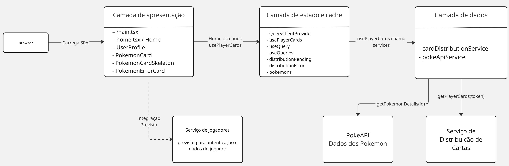

# Pokémon Card Viewer

Aplicação responsável por exibir as cartas Pokémon de cada jogador. Consulta os serviços de **distribuição de cartas** e de **jogadores**, e enriquece os dados via **PokéAPI**.

---

## Tecnologias

| Tecnologia | Uso |
|---|---|
| React 18 | UI |
| TypeScript | Tipagem estática |
| Vite | Bundler e dev server |
| Tailwind CSS | Estilização |
| Framer Motion | Animações |
| React Slick | Carrossel de cartas |

---

## Como executar

```bash
npm install
npm run dev
```

Acesse em `http://localhost:5173`.

---

## Variáveis de ambiente

```env
VITE_PLAYERS_API_URL=       # URL base do Serviço de Jogadores
VITE_CARD_DISTRIBUTION_URL= # URL base do Serviço de Distribuição de Cartas
```

---

## Contratos esperados

### Serviço de Jogadores (auth)

Resposta esperada do login/cadastro:

```json
{
  "token": "jwt-token",
  "user": {
    "id": "player-001",
    "name": "Ash",
    "email": "ash@inatel.br",
    "role": "PLAYER"
  }
}
```

### Serviço de Distribuição de Cartas

Resposta esperada ao buscar as cartas do jogador autenticado:

```json
{
  "cards": [
    { "idCarta": "card-001", "idPokemon": "1" },
    { "idCarta": "card-002", "idPokemon": "4" },
    { "idCarta": "card-003", "idPokemon": "7" },
    { "idCarta": "card-004", "idPokemon": "25" },
    { "idCarta": "card-005", "idPokemon": "39" }
  ]
}
```

Campos obrigatórios:

- `cards[].idCarta` — identificador único da carta distribuída
- `cards[].idPokemon` — ID do Pokémon compatível com a PokéAPI

> Não enviar dados completos do Pokémon. Esta aplicação usa o `idPokemon` para buscar tudo na PokéAPI diretamente.

---

## Fluxo de integração

```
login → token → distribuição de cartas → PokéAPI → tela
```

1. Usuário faz login no Serviço de Jogadores → recebe `token` + `user`
2. Token é enviado ao Serviço de Distribuição → retorna `cards[]`
3. Para cada carta, busca dados na PokéAPI via `idPokemon`
4. Os dados são transformados pelos adapters e renderizados

---

## Design Patterns

### Adapter

- `CardDistributionAdapter` — converte o JSON da Distribuição para o modelo interno
- `PokemonApiAdapter` — converte o JSON bruto da PokéAPI para o modelo interno

Se o Serviço de Distribuição retornar um formato diferente (ex: `cardId`/`pokemonId` em vez de `idCarta`/`idPokemon`), basta ajustar o `CardDistributionAdapter`.

### Strategy

Controla qual implementação de serviço é usada em cada ambiente — mock ou real — sem alterar a lógica dos componentes.

```ts
// mockStrategy: usa mock de distribuição + PokéAPI real
// realStrategy: usa serviços HTTP reais para ambos
```

Definido em `src/services/strategy/strategies.ts` e injetado via props nos hooks (`usePlayerCards`), permitindo trocar a estratégia sem reescrever nada.

### Composition

O componente `PokemonCard` é construído por composição de partes independentes, em vez de um único componente monolítico:

```tsx
<PokemonCard.Root pokemonType="fire">
  <PokemonCard.Content>
    <PokemonCard.Art />
    <PokemonCard.Header />
    <PokemonCard.TypeList />
    <PokemonCard.Stats />
    <PokemonCard.Footer />
  </PokemonCard.Content>
</PokemonCard.Root>
```

O `Root` provê o contexto de tema (cor por tipo do Pokémon) via React Context, e cada sub-componente consome esse contexto de forma independente.

---

## Diagrama de Caso de Uso


## Diagrama de Classe


## Diagrama Arquitetural



## Vídeo de Apresentação do Design Patterns
[Arquivo .zip](docs/video/design%20patterns.zip)


#### **Equipe 3:** Bruna Magalhães, João Vitor Lima e Pedro Nogueira - **Professor:** Jonas Lopes de Vilas Boas - **Monitor:** Matheus Dionisio Teixeira Andrade