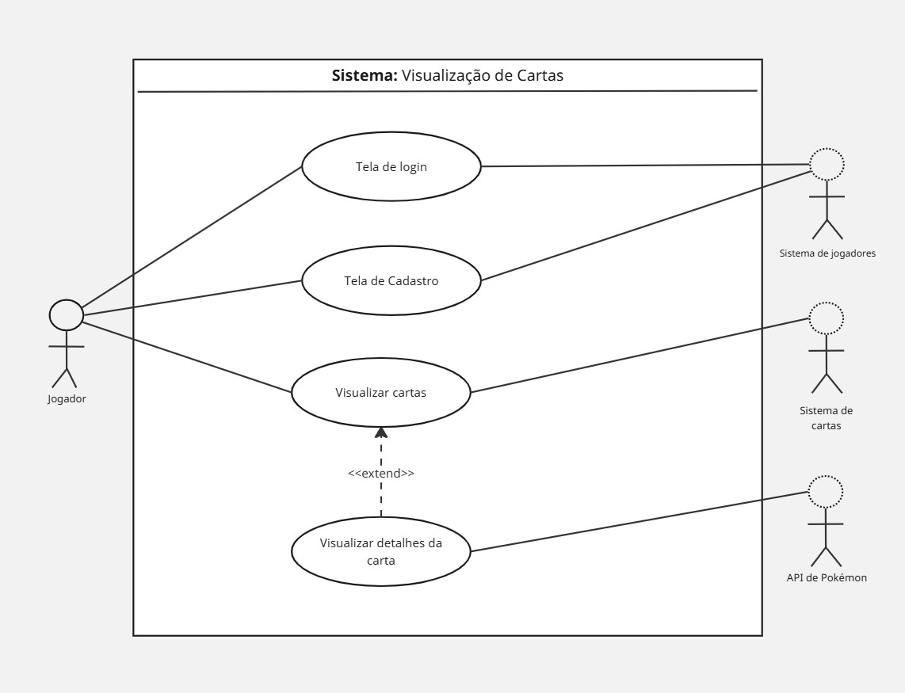
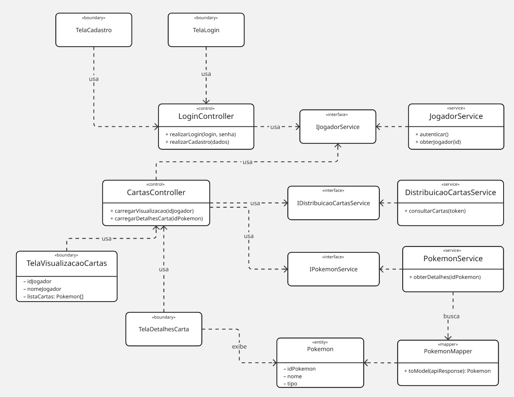

# 🃏 Visualização de Cartas — Pokémon Card Viewer

Aplicação responsável por exibir as cartas Pokémon de cada jogador. Consulta os serviços de **distribuição de cartas** e de **jogadores** para recuperar as informações necessárias, além de integrar com a **PokéAPI** para obter os dados completos de cada Pokémon.

> Projeto desenvolvido como parte de um sistema distribuído de gerenciamento de cartas Pokémon.

---

## 📋 Índice

- [Sobre a Aplicação](#sobre-a-aplicação)
- [Funcionalidades](#funcionalidades)
- [Diagramas](#diagramas)
  - [Diagrama de Caso de Uso](#diagrama-de-caso-de-uso)
  - [Diagrama de Classes](#diagrama-de-classes)
- [Tecnologias](#tecnologias)
- [Estrutura do Projeto](#estrutura-do-projeto)
- [Como Executar](#como-executar)
- [Integração com Serviços Externos](#integração-com-serviços-externos)

---

## Sobre a Aplicação

Esta aplicação é o frontend do módulo de Visualização de Cartas do sistema. Principais responsabilidades:

- Consultar o Serviço de Jogadores para autenticação e dados do jogador logado
- Consultar o Serviço de Distribuição de Cartas para recuperar as cartas atribuídas a cada jogador
- Enriquecer as cartas com dados da PokéAPI (tipos, estatísticas, imagens, habilidades)
- Renderizar as cartas de forma responsiva e interativa no navegador

Estado atual: a interface e os componentes principais estão implementados com dados mockados. A integração completa com serviços reais pode ser habilitada substituindo os mocks pelas chamadas HTTP correspondentes.

---

## Funcionalidades

- Visualização das cartas por jogador com navegação e seleção
- Modal ou painel de detalhes com informações enriquecidas do Pokémon
- Componentes de estado: skeletons de carregamento e tratamento de erro (cards de erro)
- Perfil do usuário exibido no header (nome, opções básicas)
- Integração com serviços externos (stub local + estrutura para PokéAPI)
- Layout responsivo e animações leves para melhor experiência

---

## Diagramas

### Diagrama de Caso de Uso



### Diagrama de Classes



[Versão dos diagramas no miro](https://miro.com/welcomeonboard/Mlc0NDJwdDlRTXRKUFdyUUt4KzdZZ1J0NllXN1M0YldsbVBVcVNzY3Y2RkIzN2dnUjFzalVaeEplUTRWTnAvRmd5SXhVUHZ6WkVYQ1pWRXBXbmpiT3hEUDRVUEFuNVU3aGtkNGNUOVB1VFc1VUFXV1F5QXJzcU0rSWVxVDd3VDVnbHpza3F6REdEcmNpNEFOMmJXWXBBPT0hdjE=?share_link_id=404047321847).

---

## Tecnologias

| Tecnologia | Versão | Uso |
|---|---|---|
| [React](https://react.dev/) | 18.3.1 | Biblioteca principal de UI |
| [TypeScript](https://www.typescriptlang.org/) | — | Tipagem estática |
| [Vite](https://vitejs.dev/) | 6.3.5 | Bundler e servidor de desenvolvimento |
| [Tailwind CSS](https://tailwindcss.com/) | 4.1.12 | Estilização utilitária |
| [Motion (Framer Motion)](https://motion.dev/) | 12.23.24 | Animações e transições |
| [React Slick](https://react-slick.neostack.com/) | 0.31.0 | Carrossel de cartas |

---

## Estrutura do Projeto

```
.
├── docs/                    # diagramas e documentação complementar
├── public/                  # ativos públicos (imagens estáticas, favicon, etc.)
├── src/
│   ├── components/          # componentes da UI
│   │   ├── PokemonCard.tsx
│   │   ├── PokemonCardSkeleton.tsx
│   │   ├── PokemonErrorCard.tsx
│   │   └── UserProfile.tsx
│   
│   ├── hooks/               # hooks personalizados
│   │   └── usePlayerCards.ts
│   ├── pages/               # páginas/rotas da aplicação
│   │   └── home.tsx
│   ├── schemas/             # schemas / types compartilhados
│   │   ├── playerCards.ts
│   │   └── pokemon.ts
│   └── services/            # integrações com APIs e lógica de distribuição
│       ├── cardDistribution/
│       └── pokeApi/
├── index.html
├── package.json
├── tsconfig.json
└── vite.config.ts
```

---

## Como Executar

### Pré-requisitos

- [Node.js](https://nodejs.org/) v18 ou superior
- [npm](https://www.npmjs.com/) ou [pnpm](https://pnpm.io/)

### Instalação

```bash
# Clone o repositório
git clone <url-do-repositório>
cd cardViewing

# Instale as dependências
npm install
# ou
pnpm install
```

### Desenvolvimento

```bash
npm run dev
```

A aplicação estará disponível em `http://localhost:5173`.

### Build para produção

```bash
npm run build
```

Os arquivos de produção serão gerados na pasta `dist/`.

---

## Integração com Serviços Externos

A aplicação integra com três serviços principais:

1. Serviço de Jogadores
  - Responsabilidade: autenticação, perfil e dados do jogador.
  - Uso: retorna token JWT (Bearer) utilizado nas chamadas ao Serviço de Distribuição de Cartas.

2. Serviço de Distribuição de Cartas
  - Responsabilidade: fornecer as cartas atribuídas a um jogador.
  - Retorno esperado: lista de objetos com pelo menos `idPokemon` e `idCarta`.

3. PokéAPI
  - Responsabilidade: dados públicos e enriquecidos de cada Pokémon.
  - Endpoint: `https://pokeapi.co/api/v2/pokemon/{id}` (documentação em https://pokeapi.co/).

Configuração e boas práticas

- Variáveis de ambiente (Vite): defina os endpoints usando o prefixo `VITE_`, por exemplo:

  - `VITE_PLAYERS_API_URL` — URL base do Serviço de Jogadores
  - `VITE_CARD_DISTRIBUTION_URL` — URL base do Serviço de Distribuição de Cartas

