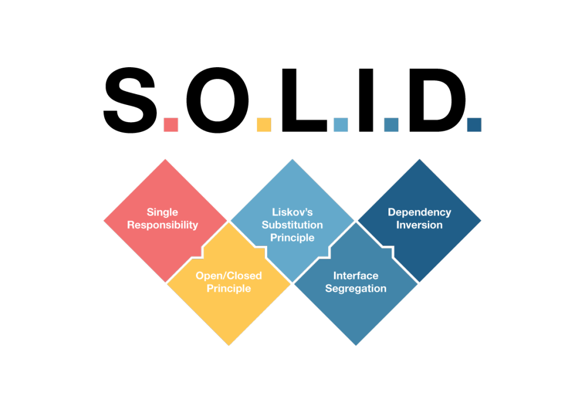

# Aplicação dos Princípios SOLID

## Introdução

Este documento descreve como os princípios SOLID foram aplicados na arquitetura do sistema desenvolvido.  
O objetivo da utilização desses princípios é tornar o código mais organizado, reutilizável, desacoplado e de fácil manutenção.

---

## 1. Single Responsibility Principle (SRP)

O **Princípio da Responsabilidade Única** define que cada classe deve possuir apenas uma responsabilidade dentro do sistema.

### Aplicação no projeto

O projeto separa claramente as responsabilidades entre as camadas da aplicação:

| Camada | Responsabilidade | Exemplos |
|---|---|---|
| **Boundary** | Interação com o usuário | `TelaLogin`, `TelaCadastro`, `TelaVisualizacaoCartas`, `TelaDetalhesCarta` |
| **Controller** | Controle do fluxo da aplicação | `LoginController`, `CartasController` |
| **Service** | Regras de negócio e comunicação com APIs | `JogadorService`, `PokemonService`, `DistribuicaoCartasService` |
| **Entity** | Representação dos dados do sistema | `Jogador`, `Pokemon` |
| **Mapper** | Conversão de dados da API para objetos internos | `PokemonMapper` |

### Vantagens

- Facilita manutenção
- Reduz acoplamento
- Melhora reutilização de código
- Facilita testes

---

## 2. Open/Closed Principle (OCP)

O **Princípio Aberto/Fechado** define que entidades devem estar abertas para extensão, mas fechadas para modificação.

### Aplicação no projeto

Este princípio não está claramente aplicado no projeto.

Embora o uso de interfaces contribua para a extensibilidade do sistema, o diagrama não evidencia mecanismos específicos que permitam adicionar novos comportamentos sem modificar classes existentes.

Além disso, em aplicações frontend com requisitos frequentemente mutáveis, a aplicação completa do OCP pode se tornar mais complexa.

### Vantagens

- Facilita expansão do sistema
- Reduz impacto de mudanças
- Melhora manutenção

---

## 3. Liskov Substitution Principle (LSP)

O **Princípio da Substituição de Liskov** define que implementações derivadas devem poder substituir suas abstrações sem comprometer o funcionamento do sistema.

### Aplicação no projeto

As implementações dos serviços seguem corretamente suas interfaces:

```txt
JogadorService -> IJogadorService
PokemonService -> IPokemonService
DistribuicaoCartasService -> IDistribuicaoCartasService
```

Dessa forma, qualquer implementação concreta pode ser utilizada pelos controllers sem alterar o comportamento esperado da aplicação.

### Vantagens

- Permite troca de implementações
- Facilita testes com mocks
- Reduz dependência direta

---

## 4. Interface Segregation Principle (ISP)

O **Princípio da Segregação de Interfaces** define que uma classe não deve ser obrigada a implementar métodos que não utiliza.

### Aplicação no projeto

O sistema utiliza interfaces específicas para cada responsabilidade:

```txt
IJogadorService
IPokemonService
IDistribuicaoCartasService
```

Cada interface possui apenas métodos relacionados ao seu domínio.

### Exemplos

- `IPokemonService` contém apenas operações relacionadas a Pokémon
- `IJogadorService` contém apenas operações relacionadas ao jogador

### Vantagens

- Interfaces menores e mais organizadas
- Reduz implementação desnecessária
- Facilita manutenção

---

## 5. Dependency Inversion Principle (DIP)

O **Princípio da Inversão de Dependência** define que módulos de alto nível não devem depender de módulos de baixo nível, mas sim de abstrações.

### Aplicação no projeto

Os controllers dependem de interfaces e não diretamente das implementações concretas dos serviços.

### Exemplos

```txt
LoginController -> IJogadorService

CartasController ->
    IPokemonService
    IDistribuicaoCartasService
```

Isso reduz o acoplamento entre as camadas do sistema e aumenta a flexibilidade da arquitetura.

### Vantagens

- Facilita testes
- Permite troca de implementações
- Reduz dependência entre módulos

---

## Conclusão

A utilização dos princípios SOLID contribuiu para uma arquitetura mais organizada, modular e de fácil manutenção.

O uso de interfaces, separação de responsabilidades e desacoplamento entre camadas facilita futuras expansões e melhorias no sistema.

#### Autores: Bruna, João Pedro, João Vitor e Pedro.